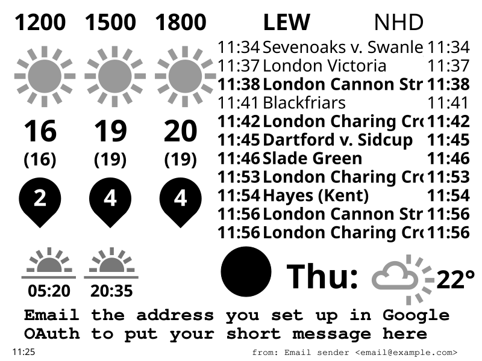

# Kindle Dashboard

A dashboard that displays your local live rail departures, the weather forecast, and some other useful information. Designed to display nicely on a jailbroken kindle.

# Prerequisites

## Kindle
Your Kindle needs to be jailbroken. Instructions are [here](https://wiki.mobileread.com/wiki/Kindle_Hacks_Information#Jail_break_JB).
Once you're jailbroken, copy the kindle-files folder to /mnt/us/ on your Kindle, rename it to 'dashboard' and add the following lines to /etc/crontab/root:

    '* * * * * /mnt/us/dashboard/display-weather.sh >>/mnt/us/dashboard/log.txt 2>>/mnt/us/dashboard/log.txt

    @reboot /mnt/us/dashboard/init-weather.sh'

Then run
    
    'etc/init.d/crontab restart'
and your kindle should download and display the latest dashboard once a minute.

## National Rail API
You need to register for an API key at https://raildata.org.uk/registerPartner.
Add it to the .env file

## Met Office API
Register for the Site-Specific API at https://datahub.metoffice.gov.uk/docs/getting-started
Add your API key to .env

## Email
Set up a Gmail address to receive emails and display them at the bottom of the screen.
Once it's set up, you need to get a Google API key. Follow the instructions at https://developers.google.com/gmail/api/quickstart/nodejs.
The instructions tell you to download a credentials.json file. Save it as assets/data/gmail-credentials.json